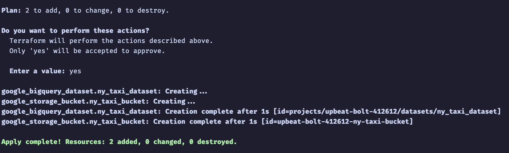

## Module 1 Homework

## Docker & SQL

In this homework we'll prepare the environment 
and practice with Docker and SQL


## Question 1. Knowing docker tags

Run the command to get information on Docker 

```docker --help```

Now run the command to get help on the "docker build" command:

```docker build --help```

Do the same for "docker run".

Which tag has the following text? - *Automatically remove the container when it exits* 

- `--delete`
- `--rc`
- `--rmc`
- `--rm`

### Solution

run this command: 
```bash
docker run --help
```
This is part of the result:
```bash
  -q, --quiet                          Suppress the pull output
      --read-only                      Mount the container's root filesystem as read only
      --restart string                 Restart policy to apply when a container exits (default "no")
      --rm                             Automatically remove the container when it exits
```
So answer is 

- `--rm`

## Question 2. Understanding docker first run 

Run docker with the python:3.9 image in an interactive mode and the entrypoint of bash.
Now check the python modules that are installed ( use ```pip list``` ). 

What is version of the package *wheel* ?

- 0.42.0
- 1.0.0
- 23.0.1
- 58.1.0

### Solution

Run this command in the terminal `docker run -it python:3.9 bash`
```bash
❯ docker run -it python:3.9 bash              
root@43f109594088:/# pip list
Package    Version
---------- -------
pip        23.0.1
setuptools 58.1.0
wheel      0.42.0

[notice] A new release of pip is available: 23.0.1 -> 23.3.2
[notice] To update, run: pip install --upgrade pip
```

So answer is 
- 0.42.0

# Prepare Postgres

Run Postgres and load data as shown in the videos
We'll use the green taxi trips from September 2019:

```wget https://github.com/DataTalksClub/nyc-tlc-data/releases/download/green/green_tripdata_2019-09.csv.gz```

You will also need the dataset with zones:

```wget https://s3.amazonaws.com/nyc-tlc/misc/taxi+_zone_lookup.csv```

Download this data and put it into Postgres (with jupyter notebooks or with a pipeline)

### Solution:

First, run `docker-compose up` to start up two containers, one is `pgdatabase` and one is `pgadmin`.

Second, run

```bash
docker build -t taxi_ingest:v002 . 
```
to build a docker image using `Dockerfile` and give it a tag `taxi_ingest:v002`

Then run the below commands to ingest the data into postgres database using `ingest_homework_data.py` as the data pipeline file.

```bash
URL="https://github.com/DataTalksClub/nyc-tlc-data/releases/download/green/green_tripdata_2019-09.csv.gz"
docker run -it \
  --network=01_docker_default \
  taxi_ingest:v002 \
    --user=root \
    --password=root \
    --host=pgdatabase \
    --port=5432 \
    --db=ny_taxi \
    --table_name=green_taxi_data \
    --url=${URL}
```

Now go to `http://localhost:8080/` and use `pgadmin` to run query
```sql
SELECT 
	COUNT(1) 
FROM 
	green_taxi_data g
```
You should get `449063`.

## Question 3. Count records 

How many taxi trips were totally made on September 18th 2019?

Tip: started and finished on 2019-09-18. 

Remember that `lpep_pickup_datetime` and `lpep_dropoff_datetime` columns are in the format timestamp (date and hour+min+sec) and not in date.

- 15767
- 15612
- 15859
- 89009

### Solution:

Run this query in `pgadmin`
```sql
SELECT 
	COUNT(1)
FROM 
	green_taxi_data g
WHERE
	date(lpep_pickup_datetime) = '2019-09-18'
AND
	date(lpep_dropoff_datetime) = '2019-09-18'
```
Answer is

- 15612

## Question 4. Largest trip for each day

Which was the pick up day with the largest trip distance
Use the pick up time for your calculations.

- 2019-09-18
- 2019-09-16
- 2019-09-26
- 2019-09-21

### Solution:

Run this query in `pgadmin`

```sql
SELECT
	date(lpep_pickup_datetime), MAX(trip_distance)
FROM 
	green_taxi_data g
GROUP BY
	1
ORDER BY 
	MAX(trip_distance) DESC
```
Answer is 

- 2019-09-26

## Question 5. Three biggest pick up Boroughs

Consider lpep_pickup_datetime in '2019-09-18' and ignoring Borough has Unknown

Which were the 3 pick up Boroughs that had a sum of total_amount superior to 50000?

- "Brooklyn" "Manhattan" "Queens"
- "Bronx" "Brooklyn" "Manhattan"
- "Bronx" "Manhattan" "Queens" 
- "Brooklyn" "Queens" "Staten Island"

### Solution:

Run this query in `pgadmin`

```sql
SELECT 
	date(t.lpep_pickup_datetime),
	z."Borough",
	SUM(total_amount)
FROM 
	green_taxi_data t, 
	zones z
WHERE
	date(lpep_pickup_datetime) = '2019-09-18' 
AND
	t."PULocationID" = z."LocationID"
GROUP BY
	1, 2
ORDER BY 
	SUM(total_amount) DESC
```
Answer is

- "Brooklyn" "Manhattan" "Queens"

## Question 6. Largest tip

For the passengers picked up in September 2019 in the zone name Astoria which was the drop off zone that had the largest tip?
We want the name of the zone, not the id.

Note: it's not a typo, it's `tip` , not `trip`

- Central Park
- Jamaica
- JFK Airport
- Long Island City/Queens Plaza

### Solution:

Run this query in `pgadmin`

```SQL
SELECT 
	z2."Zone",
	MAX(tip_amount)
FROM 
	green_taxi_data g
INNER JOIN
	zones z
ON
	g."PULocationID" = z."LocationID"
INNER JOIN
	zones z2
ON
	g."DOLocationID" = z2."LocationID"
WHERE
	z."Zone" = 'Astoria'
GROUP BY
	z2."Zone"
ORDER BY
	MAX(tip_amount) DESC
```
Answer is

- JFK Airport

## Terraform

In this section homework we'll prepare the environment by creating resources in GCP with Terraform.

In your VM on GCP/Laptop/GitHub Codespace install Terraform. 
Copy the files from the course repo
[here](https://github.com/DataTalksClub/data-engineering-zoomcamp/tree/main/01-docker-terraform/1_terraform_gcp/terraform) to your VM/Laptop/GitHub Codespace.

Modify the files as necessary to create a GCP Bucket and Big Query Dataset.


## Question 7. Creating Resources

After updating the main.tf and variable.tf files run:

```
terraform apply
```

Paste the output of this command into the homework submission form.



## Submitting the solutions

* Form for submitting: https://courses.datatalks.club/de-zoomcamp-2024/homework/hw01
* You can submit your homework multiple times. In this case, only the last submission will be used. 

Deadline: 29 January, 23:00 CET